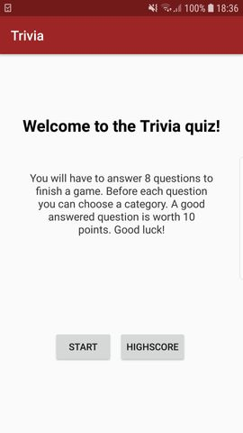
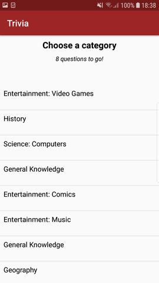
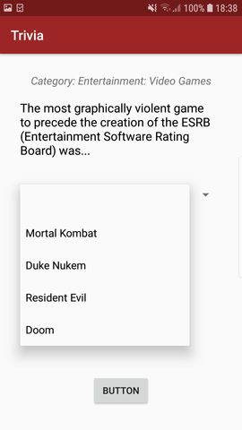
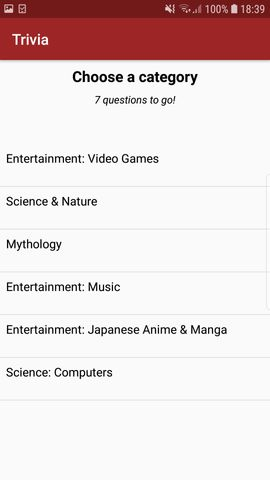
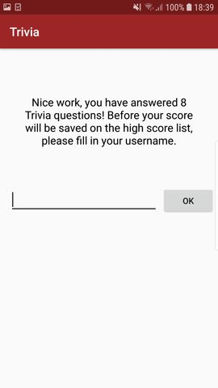
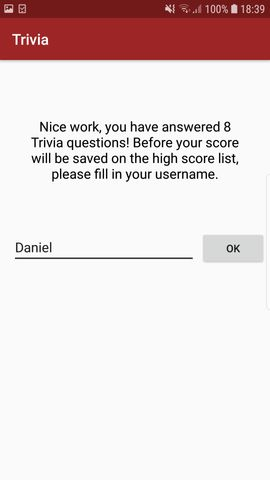
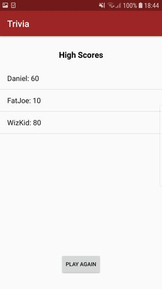

# Trivia

Jeffrey Chong, 11304669. 
App Studio, week 7. 

Android users can play the famous Trivia quiz in this app. 
Before each question the user can choose a category, each correct answer is worth 10 points.  
A game is finished when the user has answered 8 questions. 
After that, the High score screen will be displayed. 
Good luck!  

Extra:
- High score button, that takes you directly to high score list 
- The category activity (GamePlay.java), where you can choose the category of the question 
- That activity also keeps track on how much questions you still have to answer
(OnCreat: GamePlay.java) 
Purpose: Course assignment basic app development in Android. 

